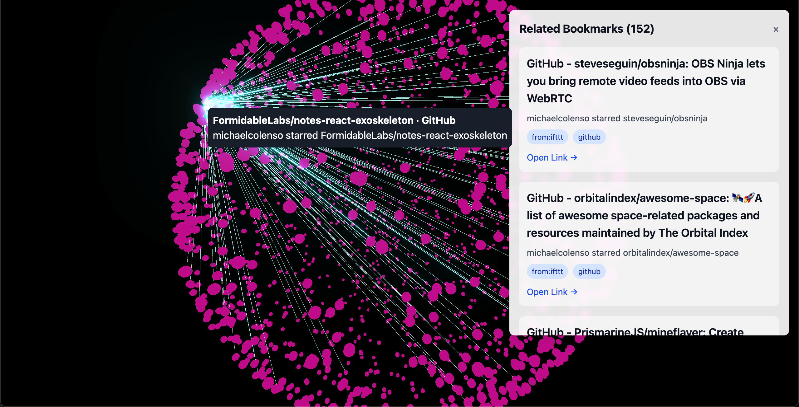

# Mikepage - 3D Bookmark Visualizer

This is a personal project to visualize my bookmarks in a 3D sphere. The bookmarks are exported from Pinboard.



## Development

This is a SvelteKit project.

### Installation

1.  Clone the repository.
2.  Install dependencies:
    ```bash
    npm install
    ```

### Running the development server

```bash
npm run dev
```

## Data

The bookmark data is loaded from a local API endpoint (`/api/bookmarks`). This data is from a Pinboard export.

## Technologies Used

*   [SvelteKit](https://kit.svelte.dev/)
*   [Three.js](https://threejs.org/)
*   [Tailwind CSS](https://tailwindcss.com/)
*   [three-forcegraph](https://github.com/vasturiano/three-forcegraph) (Note: this was part of the initial exploration but is not used in the current implementation).
