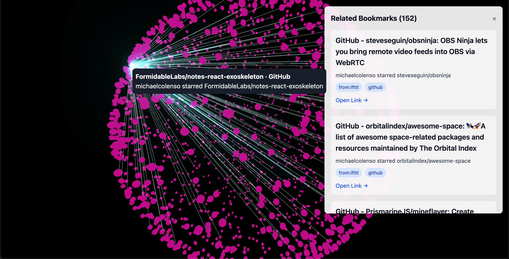

# Bookmark Visualization Project

This project is an interactive 3D visualization of bookmarks using Three.js, Svelte, and various Three.js extensions. The visualization creates a network of bookmarks, each represented as a node, and categorizes them based on tags. Users can explore related bookmarks, visualize connections, and discover interesting content clusters.


## Features

- **Guided Canopy Scene**: Bookmark clusters live in an atmospheric 3D garden with softened lighting, fog depth, and path-focused motion.
- **First-Visit Intro Guide**: A lightweight onboarding overlay explains how to start exploring.
- **Path Lens Controls**: Switch between `Closest`, `Surprising`, and `By tag family` exploration modes.
- **Editorial Focus Rail**: Selection opens a readable side rail with summary context, related paths, and relationship explanations.
- **Responsive Focus Panel**: On smaller screens the focus rail converts into a bottom-sheet layout.
- **Reduced-Motion Friendly**: Motion is toned down when reduced-motion is requested while preserving interaction clarity.

## Setup and Installation

1. **Clone the Repository**:
   ```bash
   git clone https://github.com/yourusername/bookmark-visualization.git
   cd bookmark-visualization
   ```

2. **Install Dependencies**:
   Make sure you have Node.js installed, then install the dependencies.
   ```bash
   npm install
   ```

3. **Run the Project**:
   ```bash
   npm run dev
   ```

4. **Access the Application**:
   Open your browser and navigate to `http://localhost:3000`.

## Code Overview

### Core Components

- **Svelte for UI**: The UI is built with Svelte, including interactive panels for displaying related bookmarks and tooltips.
- **Three.js for 3D Rendering**: Used for rendering bookmarks as 3D nodes within a spherical space.
- **OrbitControls and Post-Processing**: OrbitControls allows camera movement, while post-processing effects (like Unreal Bloom Pass) enhance visual quality.
- **Dynamic Tag-Based Coloring**: Tags are assigned unique colors using HSL color generation, stored in `tagColorMap`.

### Key Scripts and Logic

- **`init()`**: Initializes Three.js scene, renderer, camera, and lighting. Also sets up post-processing and controls.
- **`loadBookmarks()`**: Fetches bookmark data from an API endpoint and initiates the 3D instanced mesh of bookmarks.
- **`createConnectionLines()`**: Draws lines between related bookmarks, with line strength based on the number of shared tags.
- **`calculatePositions()`**: Calculates positions of bookmarks in 3D space for even distribution within a sphere.
- **`onMouseMove()` and `onMouseClick()`**: Handles mouse events for interactivity, including showing tooltips and selecting bookmarks.

### Configuration

- **Bookmark Cluster Radius and Levels**: Controlled by `clusterRadius` and `clusterLevels` variables, which determine the size and depth of the bookmark cloud.
- **Sphere Size and Tag-Based Scaling**: The size of each node scales based on the number of tags, creating visual distinction between nodes.

## Deployment

The site is built as a static bundle by `@sveltejs/adapter-static` and published to GitHub Pages
on every push to `main` (see `.github/workflows/deploy.yml`).

It is served from the custom domain **https://bookmarks.colenso.org**:

- `static/CNAME` contains `bookmarks.colenso.org` and is copied into `build/` at build time, which
  is what tells GitHub Pages to serve the site on that domain.
- Because the site lives at the root of its own hostname, `svelte.config.js` sets no `paths.base`.
  If the site is ever moved back to a project-path URL (e.g. `user.github.io/mikepage`), restore
  `kit.paths.base` and update the Playwright test URLs accordingly.

DNS for `bookmarks.colenso.org` must point at GitHub Pages — a single `CNAME` record for the
`bookmarks` host pointing at `<user>.github.io` — and "Enforce HTTPS" should be enabled in the
repository's Pages settings once the certificate is issued. The `colenso.org` apex is untouched.

## Customization

- **Tag Color Mapping**: Customize the color palette of tags by modifying the `generateTagColorMap()` function.
- **Post-Processing Effects**: Adjust the bloom effect's strength, radius, and threshold in the `init()` function's UnrealBloomPass configuration.
- **Bookmark Data API**: Modify the `loadBookmarks()` function to fetch data from your preferred source. Ensure the data format includes fields like `tags`, `description`, and `href`.

## Potential Enhancements

- **Additional Filter Options**: Add controls to filter bookmarks by specific tags or categories.
- **Graph Layout Options**: Experiment with different spatial layouts, such as hierarchical or cluster-based arrangements.
- **Improved Related Bookmark Discovery**: Use machine learning techniques to better categorize and find related bookmarks beyond simple tag matching.

## Troubleshooting

1. **Performance Issues**: Adjust `maxInstancesPerMesh` and reduce `sphereMaxSize` if the visualization lags.
2. **Missing Bookmark Data**: Ensure your API endpoint is reachable and returns bookmarks in the correct format.
3. **Three.js Compatibility**: Some features require specific Three.js extensions. Ensure compatibility with your version of Three.js.

## Acknowledgments

This project uses:
- **Three.js** for 3D rendering
- **Svelte** for UI components and reactivity
- **OrbitControls and LineGeometry/LineMaterial** from Three.js examples for camera controls and custom lines
- **UnrealBloomPass** for bloom effect post-processing

## License

This project is licensed under the MIT License.
